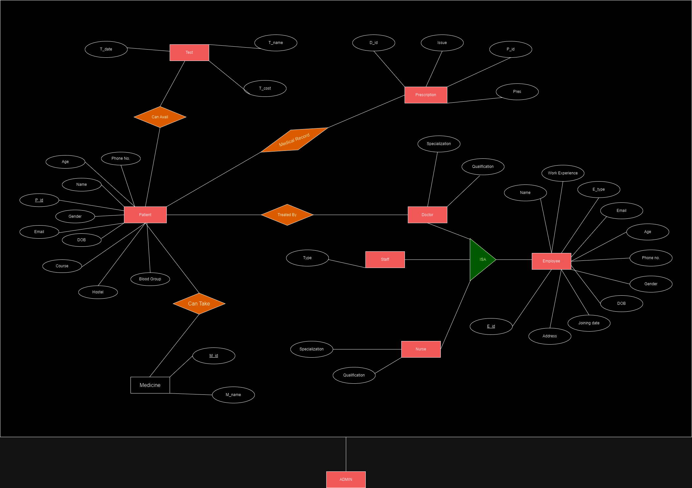

## Healthcare Management Sysytem

- <h4>A healthcare website that provides a smooth and efficient channel for patients to register themselves,        book appointments with doctors and access other basic medical services.</h4>

&nbsp&nbsp&nbsp&nbsp The implementation of HMS in our IITG Hospital will enable it to make decisions
about the way they’re run, and  &nbsp&nbsp&nbsp&nbsp the work they perform which will in turn help us treat
patients in a better way, access their real-time reports, and  &nbsp&nbsp&nbsp&nbsp other information, their
past clinical data and more can be done quickly which will lead to best patient
outcomes.

- <h4>Captured the requirement analysis using ER Diagram to convert it into suitable relations with keys and constraints.</h4>

&nbsp&nbsp&nbsp&nbspFor more detailed explanation, please refer to the <i>Detailed_Explanation</i> of the repository.

## Features

- A Login page for entering user id, password, and role (admin or patient or any employee). Access to further screens is based on the role of the user as they differ from role to role.
- A Admin Page showing the complete statistics of HMS and contains links to other pages(Pharmacy, Pathology, Rooms, Employees, Generate bill) of the portal.
- The patient can register himself/herself by filling up a registration form with his basic personal details. If the patient has previously visited the hospital then there is no need to register again.
- The employee can register himself/herself by filling up a registration form with his basic personal details. If the employee has previously visited the hospital then there is no need to register again. There is some unique information to be filled in according to the employee's role(doctor, nurse, staff).
- The patient can choose the doctor from the list of available doctors to book an appointment and mention the issue and symptoms.
- The patient can also get medicines from the hospital and also undergo different tests present in the hospital.
- The doctor can see all the appointments booked with him and accordingly provide the necessary treatment.

&nbsp&nbsp&nbsp&nbsp For more feature, please refer to the <i>E-R Diagram</i> of the repository.

## TechStack Used

 

## ER Diagram

